### Simple Library Management System
- user can add, delete, update books
- user can add, delete, update borrowers
- user can add, update authors
- user can borrow books
- user can return books

## Views:
- # Home
    Library(Database) Information is available here. In case of data not fetched and refreshed properly, force refresh button is given in the page.

    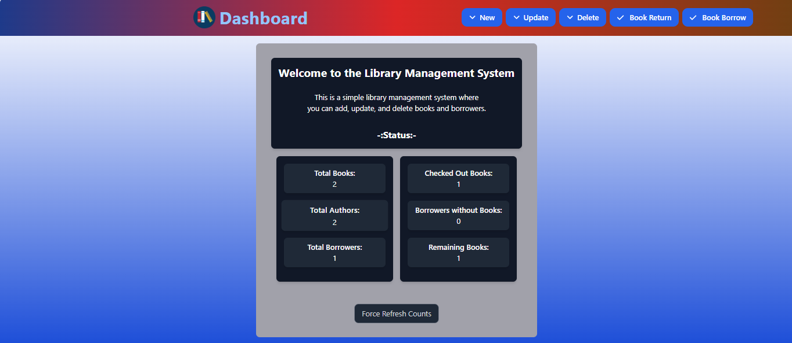

- # New

    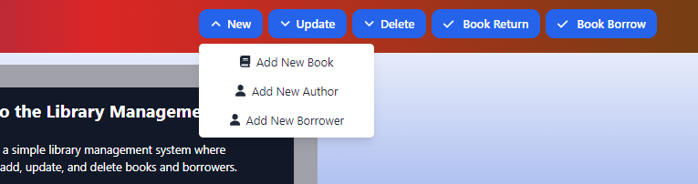
    
    - Add Book

        User can add book with the following fields:(in case of author is not in Author schema, author will automatically get added with required fields only. later user may update the secondary fields)

        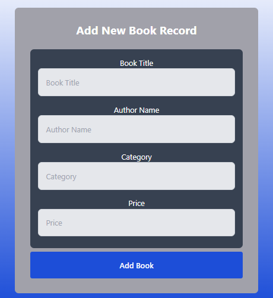
       

    - Add Borrower

        User can add borrower with the following fields:

        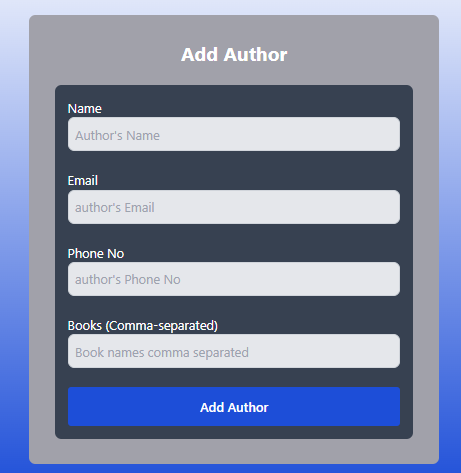

    - Add Author

        User can add author with the following fields:(in case books are not it books schema, books will automatically get added with required fields only. later user may update the secondary fields)

        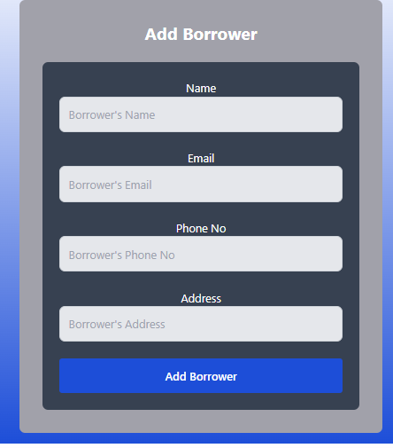

- # Update
    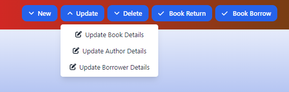
    - Update Book

        User can enter partial case insensitive book name or category and update the book with the following fields:
        on selecting the book from the booklist, user can update the book with the following fields:
        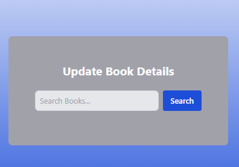

    - Update Borrower

        User can enter partial case insensitive borrower name and update the borrower with the following fields,
        on selecting the borrower from the borrower list, user can update the borrower with the following fields:

        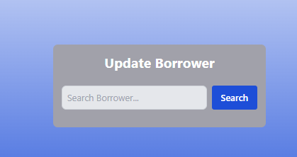

    - Update Author

        User can enter partial case insensitive author name and update the author with the following fields,
        on selecting the author from the author list, user can update the author with the following fields:

        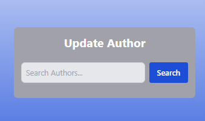

        

- # Delete
    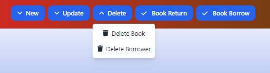
    - Delete Book

        User can enter partial case insensitive book name or category and delete the book with the following fields:
        on selecting the book from the booklist, user can re-check the values once, then by typing "delete" and pressing the Confirm Delete to delete the book from DB:

        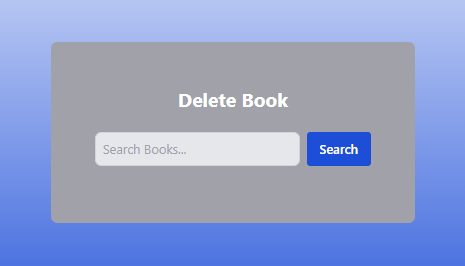

    - Delete Borrower

        Same components codes have been used for delete borrower as well.
        
         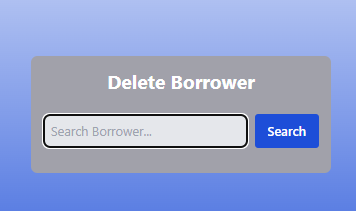

- # Book Borrow
    - Initially all books have borrower field null means it is not borrowed by any user. So, user can borrow the book by entering the partial case insensitive book name or category and partial case insensitive borrower name:

        

        on selecting the book from the booklist, user can re-check the values once, then by typing "Borrow" and pressing the Borrow button to borrow the book:

        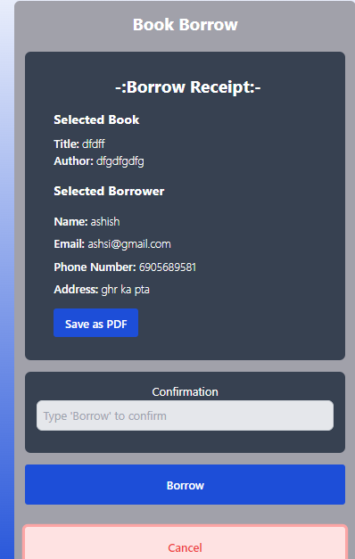

       

- # Book Return
    - Initially, all books have borrower field null means it is not borrowed by any user. The logic here is written like, the books will be shown in the booklist only if the book has some borrower (the book is checked out)
    User can verify the readOnly fields and then by typing "Return" and pressing the Return button to return the book:

    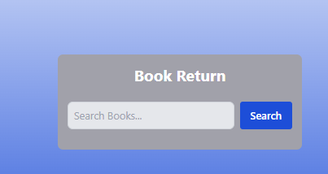

    

